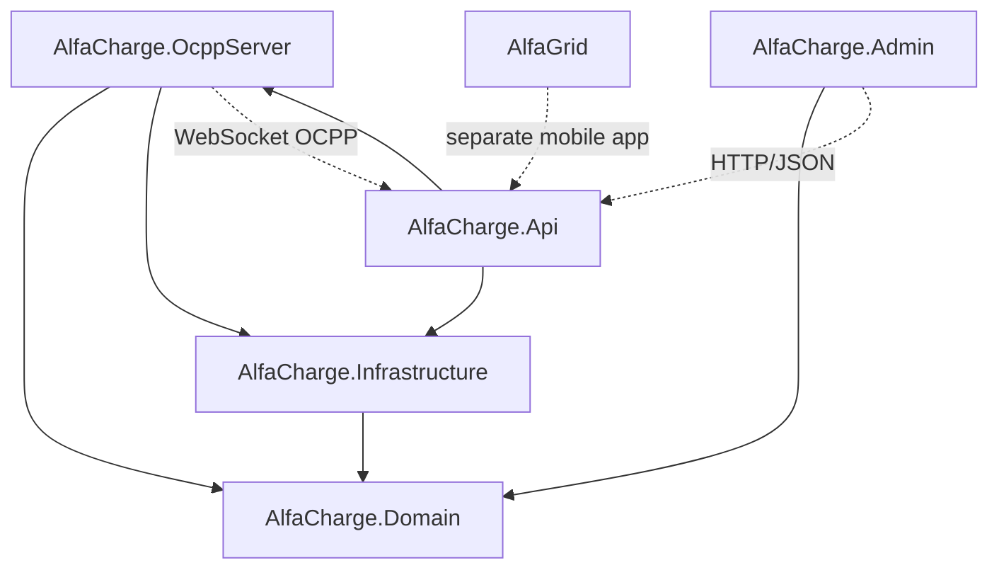
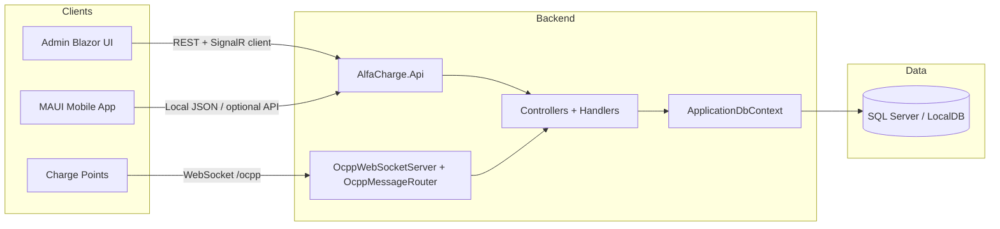
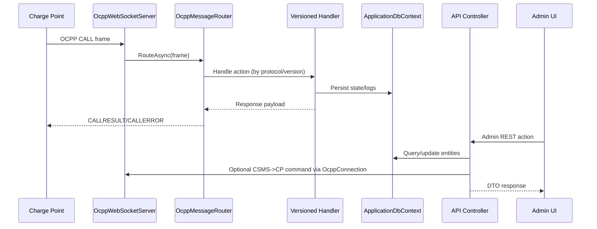

# Architecture & Codebase Analysis Document

## 1. Solution Overview

### High-level system description
The solution is an EV charging management platform with:
- A backend API and OCPP server runtime (`AlfaCharge.Api` + `AlfaCharge.OcppServer`)
- Shared domain and persistence layers (`AlfaCharge.Domain`, `AlfaCharge.Infrastructure`)
- An admin web UI (`AlfaCharge.Admin`)
- A separate mobile MAUI app (`AlfaGrid`)

### Purpose of the solution
Core business purpose appears to be:
- Manage charging stations, users, RFID cards, and locations
- Operate OCPP 1.6 / 2.0.1 station communications
- Persist charging telemetry and OCPP message logs
- Provide operational dashboards and administrative controls
- Support mobile user journeys (currently partly mock/local-data driven)

### Main architectural style
Predominantly a layered modular monolith on backend:
- Domain entities/models in `AlfaCharge.Domain`
- EF Core + services in `AlfaCharge.Infrastructure`
- API orchestration/controllers in `AlfaCharge.Api`
- OCPP protocol engine as a reusable module (`AlfaCharge.OcppServer`) hosted inside API process

UI side is split into:
- Server-side Blazor admin app (`AlfaCharge.Admin`)
- MAUI mobile app (`AlfaGrid`), currently loosely integrated with backend

## 2. Project Inventory

| Project | Type | Responsibility | Key folders/components | Important classes/services | Frameworks/packages |
|---|---|---|---|---|---|
| `AlfaCharge.Api` | ASP.NET Core Web API (`net8.0`) | Public/admin APIs, OCPP control endpoints, composition root | `Controllers/`, `DTO/`, `Helpers/`, `Program.cs` | `AdminStationsController`, `MetricsController`, `UsersController`, `RfidController`, `ChargePointController` | ASP.NET Core, EF Core Design, Swagger (`Swashbuckle`), BCrypt |
| `AlfaCharge.Infrastructure` | Class library (`net8.0`) | Persistence and infrastructure services | `DB/`, `DB/Contracts/`, `DB/Services/`, `Migrations/`, `Middleware/` | `ApplicationDbContext`, `LocationServices`, `BootNotificationService`, `StationServices`, `OCPPServices` | EF Core, EF Core SQL Server |
| `AlfaCharge.Domain` | Class library (`net8.0`) | Shared domain entities + DTO-like models | `Entities/`, `Models/`, `Models/WebSockets/` | `ChargePoint`, `Connector`, `Location`, `ChargingTransaction`, `OCPPLog`, `AppUser`, websocket request/response models | Plain .NET library |
| `AlfaCharge.OcppServer` | Protocol/server class library (`net8.0`) | WebSocket OCPP endpoint, message routing, protocol handlers, CSMS->CP actions | `WebSockets/`, `Messages/`, `Contracts/`, `Factory/`, `Versioned Handlers/`, `Versioned_Handlers/`, `Hubs/` | `OcppWebSocketServer`, `OcppMessageRouter`, `OcppConnectionManager`, `OcppConnection`, `IOcppHandlerFactory`, version-specific handlers | ASP.NET Core WebSockets, SignalR Core abstractions |
| `AlfaCharge.Admin` | Blazor Server web app (`net10.0`) | Admin portal consuming API + SignalR | `Components/`, `Services/`, `Models/`, `Program.cs` | `ApiClient`, `StationService`, `OcppAdminClient`, `OcppLogClient`, `SessionsHubClient` | MudBlazor, SignalR Client |
| `AlfaGrid` | .NET MAUI app (`net10.0-android/windows`) | Mobile UX and local feature flows | `Source/` (View, ViewModel, Services, Models), `Framework/`, `Resources/`, `Platforms/` | `MauiProgram`, `ChargingLocationService`, `AuthService`, `AppConfigurationManager`, generic `Repository<TReq,TRes>` | MAUI, CommunityToolkit.Mvvm, Refit, sqlite-net, MAUI Maps |

## 3. Dependency Mapping

### Project references (compile-time)
- `AlfaCharge.Domain` -> none
- `AlfaCharge.Infrastructure` -> `AlfaCharge.Domain`
- `AlfaCharge.OcppServer` -> `AlfaCharge.Domain`, `AlfaCharge.Infrastructure`
- `AlfaCharge.Api` -> `AlfaCharge.Infrastructure`, `AlfaCharge.OcppServer`
- `AlfaCharge.Admin` -> `AlfaCharge.Domain`
- `AlfaGrid` -> no project references to solution backend libs

### Direction (who calls whom)
- HTTP clients:
  - Admin UI -> API (`ApiClient`, base URL in admin appsettings)
- OCPP runtime:
  - Charge points -> API-hosted WebSocket endpoint `/ocpp...` -> OCPP router/handlers
- Persistence:
  - API controllers and OCPP handlers -> `ApplicationDbContext` (Infrastructure)
- Domain:
  - Shared model/entity contracts consumed by Infra/OCPP/Admin

### Shared/common layers
- `AlfaCharge.Domain` is the shared model contract layer.
- `AlfaCharge.Infrastructure` is shared by API and OCPP server for DB access.

### Potential coupling issues
- API has mixed architecture: some controllers use service abstractions (`IStationServices`, `ILocationServices`), many use `ApplicationDbContext` directly.
- OCPP module depends on Infrastructure DB directly, tightening protocol engine to EF persistence.
- Admin models largely duplicate API DTOs by shape, increasing schema drift risk.
- `AlfaGrid` appears architecturally separate and not strongly aligned to current backend endpoints.

## 4. Internal Architecture

### Layering
- Presentation/API: `AlfaCharge.Api.Controllers`
- Protocol/transport: `AlfaCharge.OcppServer.WebSockets`, `AlfaCharge.OcppServer.Messages`
- Application/service-ish logic: split between controllers and handler classes
- Persistence: `AlfaCharge.Infrastructure.DB` + EF Core migrations
- Domain state and contracts: `AlfaCharge.Domain.Entities`, `AlfaCharge.Domain.Models`

### Separation of responsibilities
- Strongest separation exists in OCPP module via contracts/factory/handlers.
- Weakest separation exists in API where business/data logic often lives in controllers.
- Infra service interfaces exist but some implementations are placeholders (`NotImplementedException`).

### Patterns in use
- Dependency Injection: central in `Program.cs` and MAUI/Blazor startup
- Service layer: partial (`ILocationServices`, `IStationServices`, etc.)
- Factory pattern: `IOcppHandlerFactory` with versioned factories
- Strategy-by-version: OCPP 1.6 vs 2.0.1 handlers
- Repository-like generic pattern exists in `AlfaGrid` framework
- DTO mapping in API controllers and Admin service clients

## 5. Data Flow

### Backend request flow (HTTP)
1. Client calls API endpoint (`AlfaCharge.Api.Controllers.*`).
2. Controller either:
   - Calls Infrastructure service contract, or
   - Queries `ApplicationDbContext` directly.
3. Entity->DTO projections happen in controller.
4. Response returns to Admin UI.

### OCPP WebSocket flow
1. Charge point opens WebSocket on `/ocpp` with protocol (`ocpp1.6` or `ocpp2.0.1`).
2. `OcppWebSocketServer` accepts, identifies CP id, creates connection-scoped services.
3. `OcppMessageRouter` deserializes OCPP frame array and dispatches by action/type.
4. Versioned handlers process payload, persist state/logs, return CALLRESULT/CALLERROR.
5. `OcppConnection` sends responses and tracks pending CSMS-initiated calls.

### Admin UI flow
1. Blazor components call `ApiClient` wrappers (`StationService`, `OcppAdminClient`, etc.).
2. API responses map to `AlfaCharge.Admin.Models` view models.
3. SignalR client (`SessionsHubClient`) listens to hub updates (if server hub endpoint mapped).

### Mobile app flow
- Current `ChargingLocationService` loads JSON from app package (`locations.json`, `stations.json`).
- Framework network stack exists (`Refit`, generic repository) but appears lightly used by active views.

## 6. Integration Points

### Databases
- SQL Server / LocalDB via EF Core
- Connection string in `AlfaCharge.Api/appsettings.json`

### External protocols/services
- OCPP 1.6 / 2.0.1 over WebSockets (charge point integration)
- SignalR client usage in Admin; server hub class exists in OCPP project

### Third-party APIs/services
- Swagger/OpenAPI
- BCrypt for password hashing
- MAUI mobile links to Google Maps URLs
- Mobile environment config includes Entra authority/scopes and other external keys (AppCenter/Firebase-style entries)

### Message queues
- No queue/bus integration found in current backend.

## 7. Extension Points

### Existing extension mechanisms
- OCPP contracts in `AlfaCharge.OcppServer/Contracts/*.cs`
- Protocol factory abstraction `IOcppHandlerFactory`
- Version-specific handler namespaces (`Ocpp16`, `Ocpp201`)
- Infrastructure service contracts (`ILocationServices`, `IStationServices`, etc.)
- Environment config interface in mobile (`IConfig`)
- DI-driven page/service registration in MAUI and Blazor startup

### Practical plugin points
- Add new OCPP action handlers by extending contracts + factory + router switch.
- Replace log writer (`IOcppLogWriter`) implementation.
- Introduce repository/application services and shift controller logic behind abstractions.
- Add environment modules in mobile via `AppConfigurationManager`.

## 8. Architectural Risks & Observations

1. DI registration gaps for interfaces used by controllers/factories.
   - `Program.cs` registers concrete handlers, but key interface mappings are not evident for interfaces requested at runtime (for example `IStatusNotificationHandler`, `IOcpp16TransactionHandler`, `IOcpp201TransactionHandler`, possibly diagnostics interfaces).
   - Risk: runtime `InvalidOperationException` when resolving dependencies.

2. SignalR hub class exists but mapping not found.
   - `AddSignalR()` is present, but `MapHub<OcppEventsHub>(...)` is not evident in startup.
   - Risk: admin `SessionsHubClient` may fail to receive live updates.

3. Service layer partially unimplemented.
   - `StationServices` and `OCPPServices` methods throw `NotImplementedException`.
   - Risk: endpoints wired to these services are non-functional or unstable.

4. Controller-layer business and data access coupling.
   - Several controllers query EF directly and contain orchestration logic.
   - Risk: harder testability, duplication, and inconsistent transaction/validation handling.

5. Namespace and naming inconsistency.
   - `AlfaCharge` vs `AlphaCharge` naming split; dual folders `Versioned Handlers/` and `Versioned_Handlers/`.
   - Risk: maintainability friction and accidental misplacement.

6. Potential stale/template endpoints.
   - Some controllers still return placeholder values (`DashboardController`, `OCPPController`).
   - Risk: API surface ambiguity and accidental production exposure.

7. Mobile app config hygiene.
   - Environment config contains hardcoded sensitive-seeming values and placeholder API base URLs.
   - Risk: security leakage and environment drift.

8. Solution path inconsistency.
   - `.sln` references `AlfaGrid` via `..\MobileApp\AlfaGrid\AlfaGrid.csproj`, while workspace contains `AlfaGrid/`.
   - Risk: build/open inconsistencies across machines.

9. Performance and persistence design considerations.
   - OCPP log writer persists each frame with immediate `SaveChangesAsync`.
   - Risk: high write amplification under heavy station traffic.

## 9. Visual Diagrams

### Project dependency diagram

### High-level architecture diagram

### Data flow diagram (OCPP + Admin)

## 10. Living Documentation Structure

Use this structure as long-term docs in-repo (recommended under `docs/architecture/`):

1. `docs/architecture/01-solution-overview.md`
   - Mission, context, bounded domains, architecture style

2. `docs/architecture/02-project-catalog.md`
   - One section per project: purpose, owner, runtime, dependencies, entry points

3. `docs/architecture/03-dependency-map.md`
   - Project reference matrix + allowed dependency rules

4. `docs/architecture/04-runtime-flows.md`
   - HTTP flows, OCPP flows, background flows, sequence diagrams

5. `docs/architecture/05-data-model.md`
   - Core entities, aggregates, EF mappings, migration policy

6. `docs/architecture/06-integration-points.md`
   - DBs, protocols, external APIs, auth providers, operational limits

7. `docs/architecture/07-extension-guidelines.md`
   - How to add endpoints, handlers, services, DTOs, and configs safely

8. `docs/architecture/08-risks-and-decisions.md`
   - Active risks, mitigations, ADR links, debt backlog

9. `docs/architecture/09-diagrams.md`
   - Canonical Mermaid diagrams kept versioned with code

10. `docs/architecture/changelog.md`
   - Update log per release/sprint with architectural deltas

## Key concrete references reviewed
- `Alfacharge.sln`
- `AlfaCharge.Api/Program.cs`
- `AlfaCharge.Api/Controllers/AdminStationsController.cs`
- `AlfaCharge.Api/Controllers/MetricsController.cs`
- `AlfaCharge.Infrastructure/DB/ApplicationDbContext.cs`
- `AlfaCharge.Infrastructure/DB/Services/StationServices.cs`
- `AlfaCharge.OcppServer/WebSockets/OcppWebSocketServer.cs`
- `AlfaCharge.OcppServer/Messages/OcppMessageRouter.cs`
- `AlfaCharge.OcppServer/Contracts/AbstractFactory/IOcppHandlerFactory.cs`
- `AlfaCharge.Admin/Program.cs`
- `AlfaCharge.Admin/Services/SessionsHubClient.cs`
- `AlfaGrid/MauiProgram.cs`
- `AlfaGrid/Source/Services/ChargingLocationService.cs`
- `AlfaGrid/Framework/Data/Network/AzureApiService/HttpClientHelper.cs`
